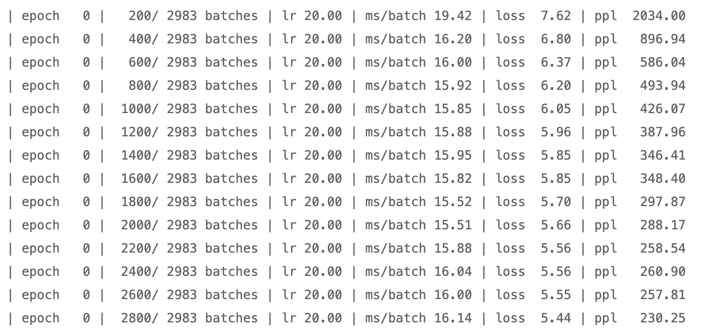
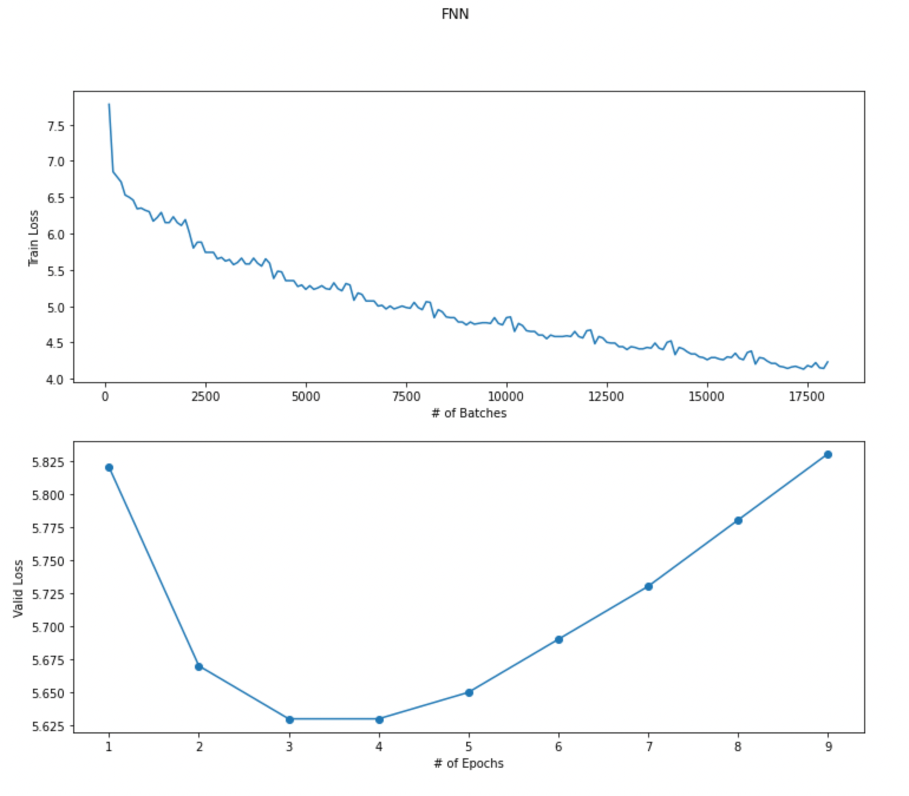
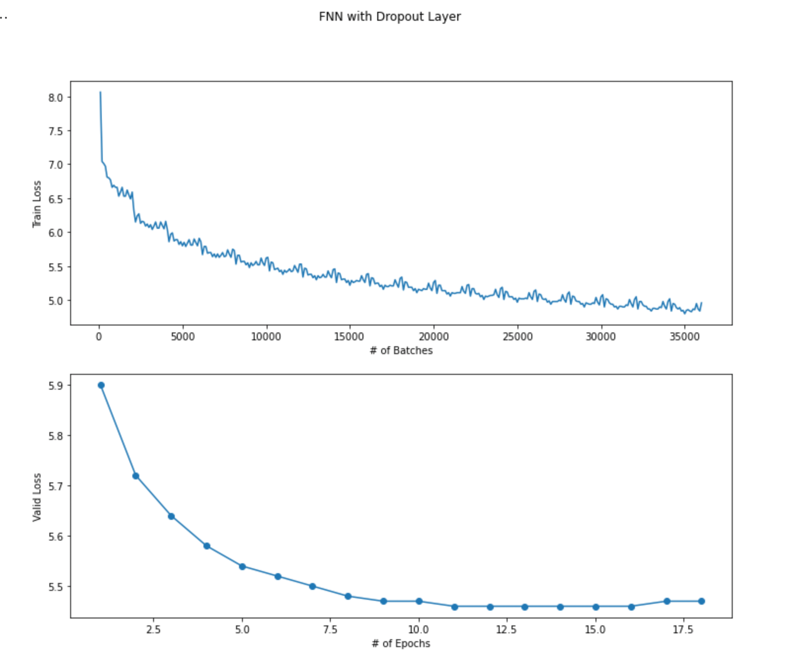
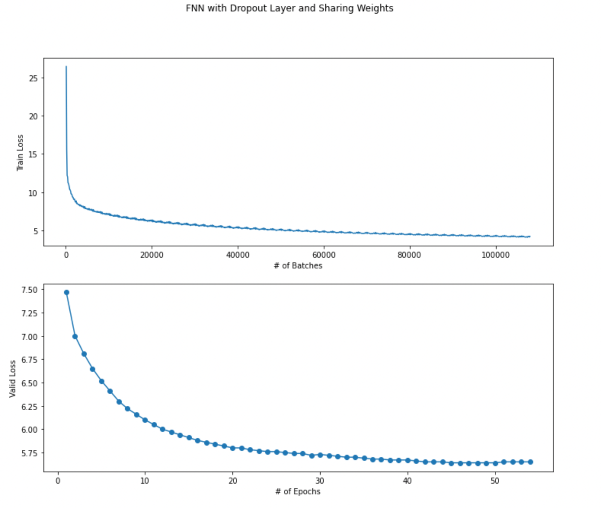

# CE7455 Assignment #1

_PENG HONGYI (G2105029E)_

___

This report attempts to answer questions in assignment one and present the corresponding experiment results and observations. Due to the imitation of file size, model checkpoints will not be included in the submitted file. Instead, all models' checkpoints, training logs, and figures can be found at [PengHongyiNTU/NLP-Assignment1 (github.com)](https://github.com/PengHongyiNTU/NLP-Assignment1).

For clarity, __Bold__ text represents the file, and ___Bold and italic___ text describes variables or classes in code.

Subsections of this report are organized according to the order of questions.

## Question 1 (i)

Downloading and running the code provided is straightforward. In __Assignment1.ipynb__, we train the default RNN model for one epoch. The training log is presented below.



As the training goes on, the loss and perplexity gradually decrease as expected.

## Question 1 (ii)

The ___Corpus___ class and the ___batchify___ function handle preprocessing and dataloading in the provided code.

The ___Corpus___ class load the dataset from raw text files and then map unique words that appeared in the dataset with integer indexes. It also adds a "<eos>" tag at the end of every sentence.

The ___batchify___  function prepares the data as a $\text{batch size} \times \text{num batch}$ tensor.

## Question 1 (iii)

The ___FNNModel___ is declared in __TrainFNN.py__ as:

```python
class FNNModel(nn.Module):
    def __init__(self, n_token, n_emb, n_hidden, seq_len):
        super().__init__()
        self.n_token = n_token
        self.n_emb = n_emb 
        self.n_hidden = n_hidden
        self.seq_len = seq_len
        self.encoder = nn.Embedding(n_token, n_emb)
        self.hidden = nn.Linear(n_emb*seq_len, n_hidden)
        self.decoder = nn.Linear(n_hidden, n_token)
    
    def forward(self, input):
        emb = self.encoder(input)
        batch_size = emb.shape[0]
        emb = emb.view(batch_size, -1)
        out = self.hidden(emb)
        out = torch.tanh(out)
        decoded = self.decoder(out)
        decoded = nn.functional.log_softmax(decoded, dim=1)
        return decoded
```

Where ___n_token___ is the length of the word to index mapping stored in ___Corpus___.

 ___n_emb___ is the dimension of embedding; in our experiments, it is set to 200 for all our experiments.

___n_hidden___ is the dimension of the hidden layer. Also, it is set to 200 in all our experiments.

___seq_len___ is the number of previous words used to predict the next word. 

Moreover, since the dataloading function in the provided code is not compatible with our ___FNNModel___, we write our dataloading function as follows.

```python
class SequenceDataset(torch.utils.data.Dataset):
    def __init__(self, tensor_data, seq_len):
        self.data = tensor_data
        self.seq_len = seq_len

    def __len__(self):
        return len(self.data) - self.seq_len - 1

    def __getitem__(self, i):
        return self.data[i:i+self.seq_len], self.data[i+self.seq_len]
```

And loading data through mini-batches can be easily achieved using.

```python
 train_loader = torch.utils.data.DataLoader(SequenceDataset(
        corpus.train, seq_len=SEQ_LEN), batch_size=TRAIN_BATCH)
 val_loader = torch.utils.data.DataLoader(SequenceDataset(
        corpus.valid, seq_len=SEQ_LEN), batch_size=EVAL_BATCH)
 test_loader = torch.utils.data.DataLoader(SequenceDataset(
        corpus.test, seq_len=SEQ_LEN), batch_size=EVAL_BATCH)
```

## Question 1 (iv)

The hyperparameter for the FNN model is set to be: 

* Batch size for training: 1024
* Batch size for evaluation (testing and validation): 10000
* Maximum number of epochs: 60
* Optimizer: Adam with 0.001 learning rate 
* ___seq_len___: 10

To avoid overfitting, we introduce the early-stopping mechanism. That is to say, if the validation loss does not increase for 5 epochs, training stops, and the best model on validation sets so far is kept.

One may find the source code and reproduce the training results using __TrainFNN.py__.

The training log is kept in __train-fnn-log.txt__.

As shown in the figure below



The ___FNNModel___ apparently overfits the training datasets as the training loss continues to decrease while validation loss starts to increase, which triggers early stops. Model at epoch 3 is kept.

## Question 1 (v)

We evaluate the performance of our ___FNNModel___ on the testing set; the results are provided below.

| Model          | Valid Loss | Valid PPL | Test Loss | Test PPL |
| -------------- | ---------- | --------- | --------- | -------- |
| ___FNNModel___ | 5.63       | 278.35    | 5.54      | 253.82   |

(PPL stands for perplexity)

### Dropout 

Before moving to the next question, we attempt to address the overfitting problem by adding dropout and decreasing ___seq_len___

We build a new model ___FNNModelDropout___ in __TrainWithDropOut.py__ as 

```python
class FNNModelDropout(nn.Module):
    def __init__(self, n_token, n_emb, n_hidden, seq_len, dropout_p=0.5):
        super().__init__()
        self.n_token = n_token
        self.n_emb = n_emb
        self.n_hidden = n_hidden
        self.seq_len = seq_len
        self.encoder = nn.Embedding(n_token, n_emb)
        self.hidden = nn.Linear(n_emb*seq_len, n_hidden)
        self.decoder = nn.Linear(n_hidden, n_token)
        self.dropout = nn.Dropout(dropout_p)

    def forward(self, input):
        emb = self.encoder(input)
        batch_size = emb.shape[0]
        emb = emb.view(batch_size, -1)
        out = self.hidden(emb)
        out = torch.tanh(out)
        out = self.dropout(out)
        decoded = self.decoder(out)
        decoded = nn.functional.log_softmax(decoded, dim=1)
        return decoded
```

Moreover, we want to reduce the number of parameters to mitigate overfitting. In our model. the number of parameters in the hidden layer is determined by ___n_emb___ times ___seq_len___. Thus, this time, for ___FNNModelDropout___, his time, ___seq_len___ is reduced from 10 to 7.



Adding dropout can indeed mitigate overfitting. This time, the best model is at epochs 12 

We also evaluate the performance of ___FNNModelDropout___.

| Model                 | Valid Loss | Valid PPL | Test Loss | Test PPL |
| --------------------- | ---------- | --------- | --------- | -------- |
| ___FNNModelDropout___ | 5.46       | 234.95    | 5.37      | 215.76   |

The complete training log can be found at __train-fnn-dropout-log.txt__.

## Question 1 (vi)

In this section, we tie the weights of input (look-up matrix) and output layer by

```python
class FNNModelSharingWeights(nn.Module):
    def __init__(self, n_token, n_emb, n_hidden, seq_len, dropout_p=0.5):
        super().__init__()
        assert n_emb == n_hidden
        self.n_token = n_token
        self.n_emb = n_emb
        self.n_hidden = n_hidden
        self.seq_len = seq_len
        self.encoder = nn.Embedding(n_token, n_emb)
        self.hidden = nn.Linear(n_emb*seq_len, n_hidden)
        self.decoder = nn.Linear(n_hidden, n_token)
        self.dropout = nn.Dropout(dropout_p)
        # Tie the weights here
        self.decoder.weight = nn.Parameter(self.encoder.weight)

    def forward(self, input):
        emb = self.encoder(input)
        batch_size = emb.shape[0]
        emb = emb.view(batch_size, -1)
        out = self.hidden(emb)
        out = torch.tanh(out)
        out = self.dropout(out)
        out.shape
        decoded = self.decoder(out)
        decoded = nn.functional.log_softmax(decoded, dim=1)
        return decoded
```

We add dropout and let ___n_seq___ = 7 due to our observation in the previous section.



We obtain a more smooth curve (complete training log in __train-fnn-sharing-log.txt__), and the training stops at epoch 54, where the best model is at epoch 49

We present the experimental results for all previous models for comparison.

| Model                        | Valid Loss | Valid PPL | Test Loss | Test PPL   |
| ---------------------------- | ---------- | --------- | --------- | ---------- |
| ___FNNModelSharingWeights___ | 5.64       | 281.85    | 5.55      | 257.84     |
| ___FNNModelDropout___        | 5.46       | 234.95    | 5.37      | __215.76__ |
| ___FNNModel___               | 5.63       | 278.35    | 5.54      | 253.82     |

In terms of testing perplexity scores, ___FNNModelDropout___ achieves superior performance. 

## Question 1 (vii)

___generate_words___ function in __generate.ipynb__ can generate text based on a few random words

```python
def generate_word(len_seq=10, data_dir='./data/wikitext-2', out_dir='generated_words.txt', checkpoints='model.pt', temperature=1, num_words=1000):
    device = torch.device("cuda" if torch.cuda.is_available() else 'cpu')
    model = torch.load(checkpoints, map_location=device)
    model.eval()
    corpus = data.Corpus(data_dir)
    n_tokens = len(corpus.dictionary)
    input = torch.randint(n_tokens, (1, len_seq), dtype=torch.long).to(device)
    with open(out_dir, 'w') as file:
        with torch.no_grad():
            for i in range(num_words):
                output = model(input)
                word_weights = output.squeeze().div(temperature).exp().cpu()
                word_idx = torch.multinomial(word_weights, 1)[0]
                # FIFO queue
                next_word = torch.tensor([word_idx]).view(1, -1).to(device)
                input = torch.cat((input[:, 1:], next_word), dim=1)
                word = corpus.dictionary.idx2word[word_idx]
                file.write(word + ('\n' if i % 20 == 19 else ' '))
                if i % 100 == 0:
                    print('| Generated {}/{} words'.format(i, num_words))

```

We present the text generation results for all three models, and the full texts can be found at __generated_words_fnn.txt__, __generated_words_fnn_dropout.txt,__ and __generated_words_fnn_sharingweights.txt,__ respectively

> ___FNNModel___:  Despite neither skull 's patience can pulls Smith they were complete spindle turn off from
> 1830 . 99th larger fields and the native takes his control of further energy . It is only common themed
> account in another psychoactive literature 

> ___FNNModelDropout___: These to London megalithic visuals leaves on the coast , which
> describes a fun where they accumulate in Les him " 1942 . Bono , found guilty measurements from star can
> destroy in the numbers of his claims on much of his death in only fall years 

> ___FNNModelSharingWeights___:  single constitution in on the 6 8 years . The
> discovery of fungus , and small deposits . <unk> <unk> is unstable much accessible more connection with the star due
> to the rocky core . And a red cap . The reviewing the arch is today has a a simple
> image form " in the book , describing the song " is almost close to an historical principles of his
> memories . 

All of them do not make any sense to me.

## Question 1 (viii)

In my opinion, the hidden layer: $\text{embedding dimension $\times$ length of the sequence} \mapsto \text{hidden dimension}$ is the most expensive one in inference or forward pass. A possible to improve the computation complexity is through knowledge distilling.

## Question 1 (viiii)

Code to compute the spearman correlation can be found at __similarity.ipynb__.

Here we present the calculated correlation coefficients and p-value of spearman correlation for all three models.

| Model                        | Coefficients | p-value         |
| ---------------------------- | ------------ | --------------- |
| ___FNNModelSharingWeights___ | 0.30         | $4.073*10^{-5}$ |
| ___FNNModelDropout___        | 0.099        | 0.182           |
| ___FNNModel___               | 0.064        | 0.391           |

A smaller p-value indicates that the similarity between embeddings is more likely to correlate with human-labeled similarity. That is to say, ___FNNModelSharingWeights___ generate more meaningful embedding.

## Question 2

* (i): 10 mins
* (ii): 2 mins
* (iii): 1 hour
* (iv): 1 hour
* (v): 2 hours 
* (vi): 1 hour
* (vii): 10 mins
* (viii): 1 min
* (ix): 15 mins

